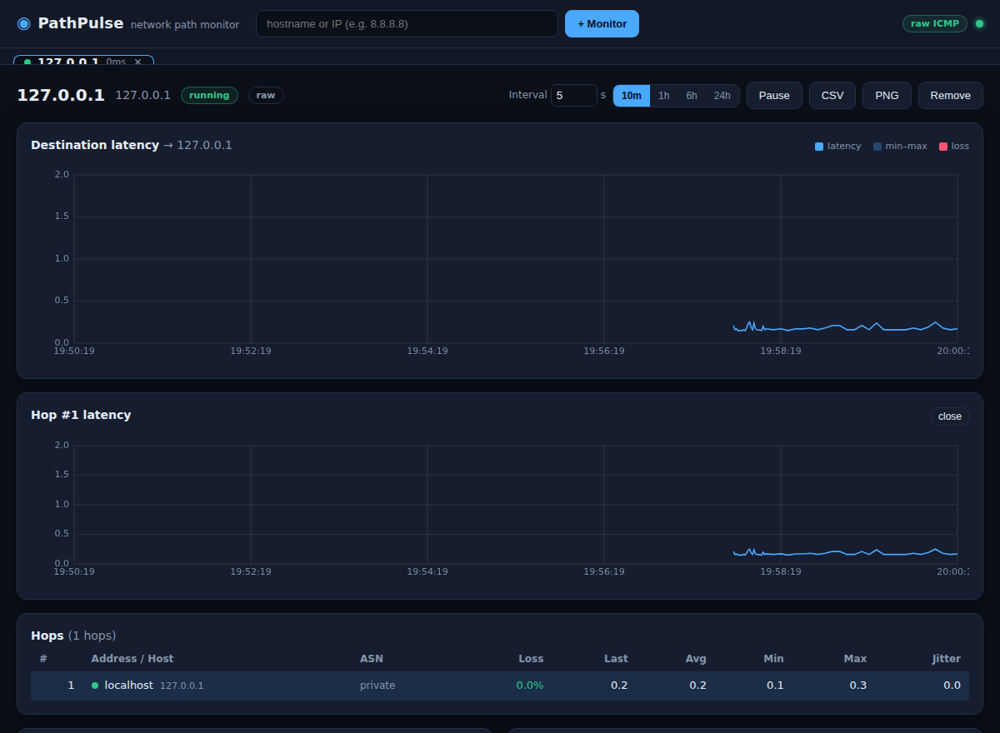

# PathPulse

**Continuous network‑path monitoring for macOS (and Linux), with a live local
web UI.** Think PingPlotter / SmokePing, but self‑hosted, dependency‑light, and
open in your browser at `localhost`.

PathPulse runs a continuous traceroute to one or more targets, tracks
per‑hop latency / packet‑loss / jitter over time, colour‑codes problem hops,
persists everything to SQLite so you can review past incidents, and fires a
native macOS notification when a path degrades past your thresholds.



---

## Features

- **Continuous traceroute** to any hostname/IP, re‑run on a configurable
  interval (default **2.5 s**, adjustable **1–60 s**) — live from the UI.
- **Per‑hop metrics**: latency (min / avg / max / current), packet‑loss %, and
  jitter, over a sliding window.
- **Time‑series graphs** for the destination *and* each hop, with selectable
  windows: **10 min / 1 hr / 6 hr / 24 hr**.
- **Problem‑hop highlighting** by packet loss: 🟢 `<1%` · 🟡 `1–5%` · 🔴 `>5%`.
- **Reverse DNS** for every hop, plus **ASN / AS‑name** lookup (free, keyless,
  via Team Cymru — degrades gracefully offline).
- **Multiple targets at once**, each in its own tab.
- **Session persistence** to SQLite, with **automatic pruning** of data older
  than 7 days (configurable).
- **Exports**: CSV of the raw samples, and a PNG snapshot of the current graph.
- **Alerting**: latency `> X ms` **or** loss `> Y%` for **Z consecutive**
  passes → a macOS notification (and a logged event).
- **Graceful privilege handling**: raw ICMP when run with `sudo`, automatic
  fallback to unprivileged ICMP otherwise.

---

## Requirements

- **Python 3.9+**
- macOS or Linux
- Two pip packages (`fastapi`, `uvicorn`) — installed automatically by `run.sh`.
  The traceroute engine itself uses only the Python standard library.

---

## Quick start

```bash
cd pathpulse
./run.sh 8.8.8.8            # bootstraps a venv, installs deps, starts the UI
```

Then open **http://127.0.0.1:8787** and add targets from the box at the top,
or pass them on the command line as shown.

For **full per‑hop detail** (raw ICMP sockets need root on macOS):

```bash
sudo ./run.sh 8.8.8.8
```

> **Why sudo?** macOS restricts raw ICMP sockets (`SOCK_RAW`) to root. With
> `sudo`, PathPulse sends and receives ICMP directly and can see every hop's
> `Time Exceeded` responses. **Without** `sudo` it falls back to an
> *unprivileged* ICMP socket — destination latency is accurate, but
> intermediate‑hop visibility is best‑effort and OS‑dependent. PathPulse tells
> you which mode is active via the badge in the top‑right (`raw ICMP` vs the
> fallback). Nothing crashes without root; you simply get less path detail.

If you prefer not to use the script:

```bash
python3 -m venv .venv && source .venv/bin/activate
pip install -r requirements.txt
sudo .venv/bin/python -m pathpulse 8.8.8.8
```

---

## Test the engine on its own

The ICMP/traceroute engine was built and tested **before** the UI, and you can
exercise it directly — no web server involved:

```bash
sudo python3 scripts/engine_smoketest.py 8.8.8.8
sudo python3 scripts/engine_smoketest.py --passes 3 --interval 1 example.com
```

It prints a traceroute‑style table (hop, address, loss %, per‑probe RTTs) and
reports the active socket mode.

---

## Command‑line options

```
python -m pathpulse [targets...] [options]

  targets                 optional hostnames/IPs to start monitoring on launch
  --host HOST             bind address (default 127.0.0.1)
  --port PORT             port (default 8787)
  --interval SECONDS      traceroute interval, clamped to 1–60 (default 2.5)
  --max-hops N            maximum TTL to probe (default 30)
  --probes N              probes per hop per pass (default 3)
  --timeout SECONDS       per‑pass response timeout (default 2.0)
  --db PATH               SQLite file (default data/pathpulse.sqlite)
  --retention-days N      prune samples older than this (default 7)
  --mode {auto,raw,dgram} ICMP socket mode (default auto → raw if privileged)
  --no-dns                disable reverse‑DNS lookups
  --no-asn                disable ASN lookups
```

Interval, alert thresholds, the time window, and pause/resume are all also
adjustable **live from the UI** per target.

---

## How it works

```
 ┌────────────┐   ICMP echo (TTL 1..N)    ┌─────────────────┐
 │  Prober    │ ───────────────────────▶  │  network path   │
 │ raw/dgram  │ ◀───────────────────────  │  routers + dest │
 └────────────┘   echo‑reply / TTL‑exceeded└─────────────────┘
        │
        ▼
 ┌────────────┐  per pass  ┌──────────┐  ┌──────────┐  ┌──────────┐
 │ Traceroute │──────────▶ │  Stats   │  │ Storage  │  │  Alerts  │
 │  (sweep)   │            │ (rolling)│  │ (SQLite) │  │(macOS 🔔)│
 └────────────┘            └────┬─────┘  └────┬─────┘  └────┬─────┘
        │                       │             │             │
        └───────── Monitor (thread per target) ─────────────┘
                                │
                         WebSocket push
                                ▼
                    FastAPI  →  browser UI (localhost)
```

Rather than walking one hop at a time, each pass fires **all** TTL probes up
front and collects the responses within one time window, so a full‑path sweep
is fast enough to repeat every couple of seconds.

### Project layout

```
pathpulse/
├── run.sh                     launcher (venv + deps + start)
├── requirements.txt
├── pyproject.toml
├── pathpulse/
│   ├── icmp.py         ICMP packet build/parse (pure, unit‑tested)
│   ├── probe.py        socket layer: raw + unprivileged fallback
│   ├── traceroute.py   parallel‑sweep traceroute engine
│   ├── stats.py        rolling min/avg/max/loss/jitter per hop
│   ├── resolver.py     cached reverse‑DNS + Team Cymru ASN
│   ├── storage.py      SQLite: samples, series, pruning
│   ├── alerts.py       threshold evaluation + macOS notifications
│   ├── monitor.py      per‑target continuous loop
│   ├── manager.py      many monitors (tabs) + retention pruner
│   ├── server.py       FastAPI: WebSocket + REST + CSV export
│   ├── __main__.py     `python -m pathpulse` CLI
│   └── web/            index.html · app.js · chart.js · style.css
├── scripts/engine_smoketest.py
└── tests/              pytest: icmp, stats, storage, alerts
```

---

## Data, storage & retention

- Every hop of every pass is written to SQLite as a raw sample (also what CSV
  export dumps). Summary stats are derived, not stored.
- Time‑series queries downsample into averaged buckets so a 24‑hour window
  stays lightweight in the browser.
- A background thread prunes samples/events older than `--retention-days`
  (default 7) shortly after start and then hourly.
- History survives restarts: relaunch PathPulse and re‑add the same target to
  see its past graphs.

## Exports

- **CSV** — the `CSV` button downloads raw samples for the selected time window
  (`timestamp, ttl, address, is_dest, sent, received, loss%, rtt_best, rtt_avg`).
- **PNG** — the `PNG` button saves a snapshot of the current destination graph,
  rendered client‑side straight from the chart canvas.

## Alerting

Enable alerts per target and set the thresholds. An alert is **edge‑triggered**:
it fires once when latency **or** loss stays over threshold for *N* consecutive
passes, and a matching **recovered** event fires when things return to normal —
so a persistent problem produces one notification, not a flood. On non‑macOS
platforms the event is still logged and shown in the UI; only the desktop
popup is macOS‑specific.

---

## Testing

```bash
source .venv/bin/activate
pip install pytest
pytest -q
```

Covers ICMP parsing (including `Time Exceeded` hop recovery), the rolling‑stats
math, SQLite insert/query/prune, and the alert state machine.

---

## Troubleshooting

| Symptom | Cause / fix |
|---|---|
| Badge shows the fallback mode, not `raw ICMP` | Not running as root. Re‑run with `sudo ./run.sh` for full detail. |
| All hops but the destination show as `*` | Some routers rate‑limit or drop `Time Exceeded`; this is normal. |
| No ASN / hostname on some hops | Private/LAN hops are labelled `private`; public ASN lookups need outbound TCP:43 and DNS — they degrade gracefully if blocked. |
| “Could not open an ICMP socket …” | The OS blocked both raw and unprivileged ICMP. Run with `sudo`. |
| Port already in use | Start with `--port <n>`. |

---

## Notes & scope

- PathPulse binds to `127.0.0.1` by default — it is a **local** tool and has no
  authentication. Only expose it beyond localhost on a trusted network.
- IPv4 ICMP today. IPv6 and TCP‑SYN probing are natural next steps.
